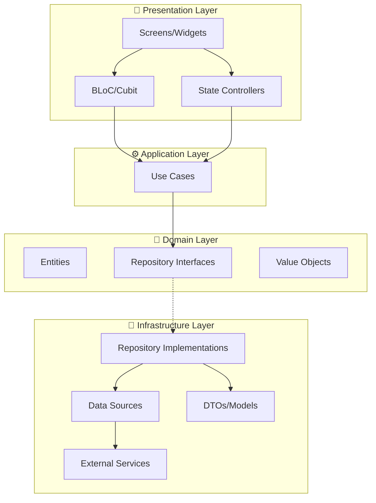
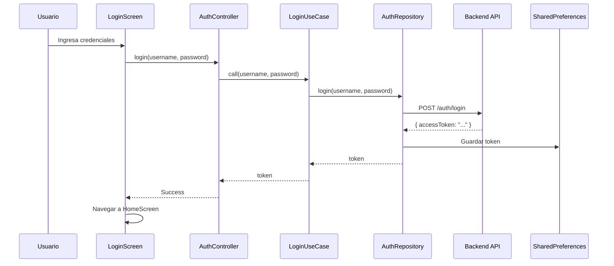
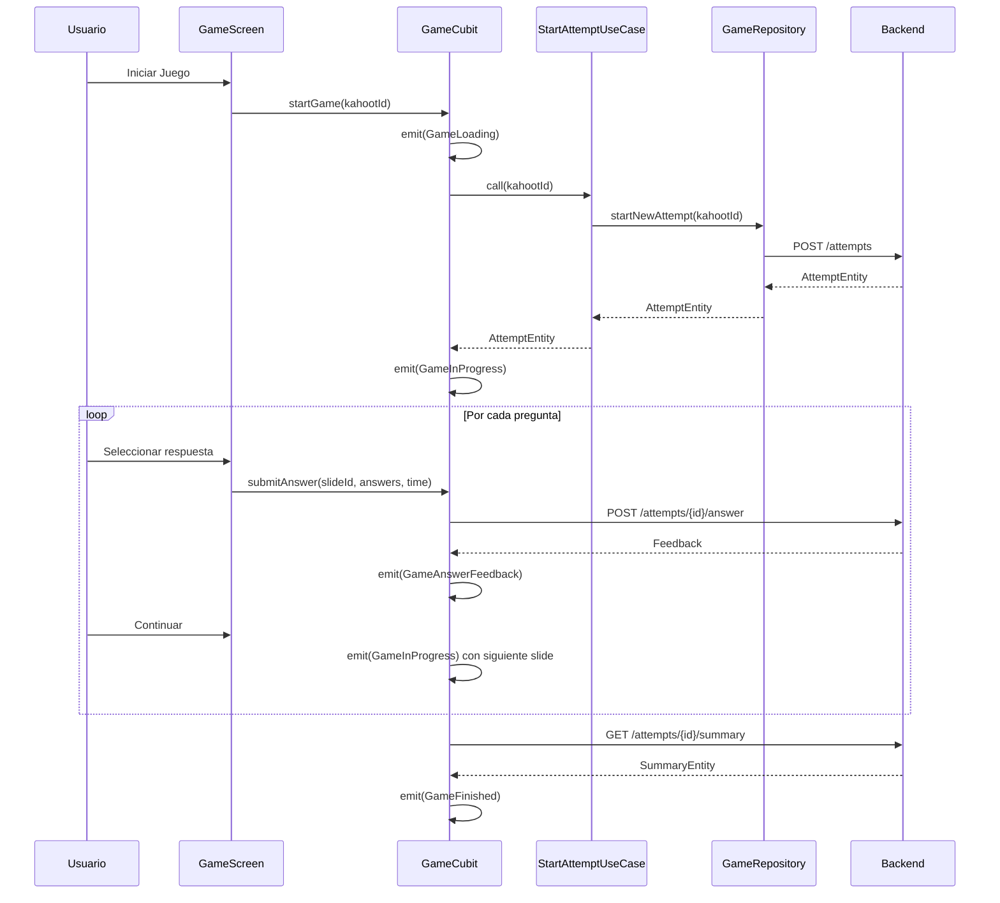
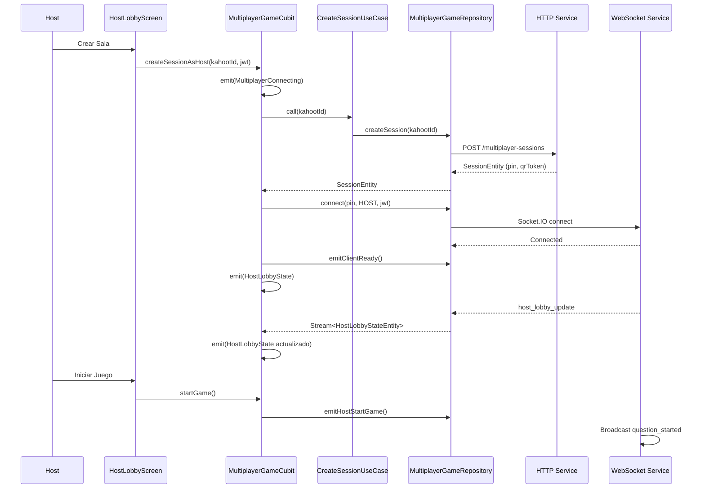
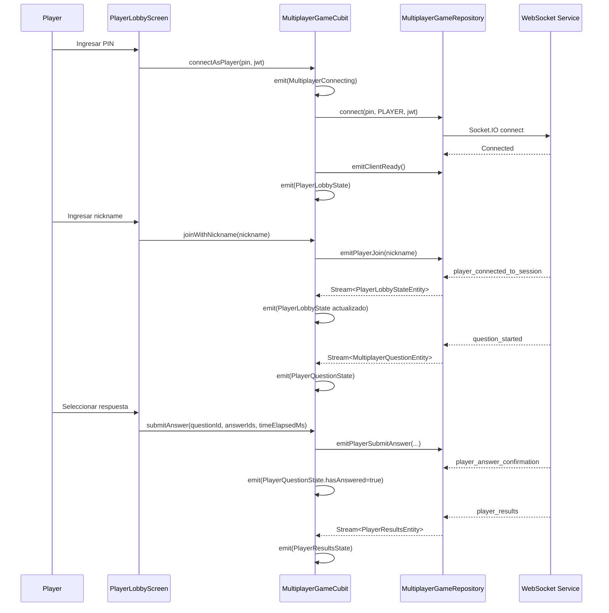

# Quizzy - Kahoot Clone 🎓📱

Bienvenido a **Quizzy**, una plataforma de aprendizaje interactivo y gamificación diseñada como un clon funcional de Kahoot. Este proyecto fue desarrollado como parte de la asignatura **Desarrollo de Software** de la **Universidad Católica Andrés Bello (UCAB)**.

**Quizzy** permite a los usuarios crear, compartir y jugar cuestionarios en tiempo real, ofreciendo una experiencia dinámica tanto para el anfitrión (Host) como para los jugadores.

---

## 🌟 Funcionalidades Principales

### 🔐 Autenticación y Perfil
*   **Gestión de Usuarios**: Registro e inicio de sesión seguro.
*   **Perfiles Personalizados**: Configuración de avatar (incluyendo carga de imágenes) y datos de usuario.

### 🎮 Experiencia de Juego (Multiplayer & Solo)
*   **Modo Multijugador Real-Time**: 
    *   **Anfitrión (Host)**: Controla el flujo de la partida, ve el ranking en tiempo real y gestiona la sala.
    *   **Jugador (Player)**: Se une mediante un **PIN de sesión** o escaneando un **código QR**.
    *   **Sincronización Total**: Comunicación fluida mediante WebSockets para una experiencia sin latencia.
*   **Modo Solo**: Practica y mejora tus conocimientos de forma individual.
*   **Feedback Inmediato**: Animaciones y efectos visuales al acertar o fallar preguntas.

### 📝 Creación y Gestión (Kahoots)
*   **Editor de Cuestionarios**: Crea tus propios "Kahoots" con diferentes tipos de preguntas.
*   **Integración con IA (OpenAI)**: 🤖 Generación automática de imágenes para tus preguntas utilizando inteligencia artificial.
*   **Explorador (Discovery)**: Encuentra y juega cuestionarios creados por la comunidad.

### 📊 Reportes y Analíticas
*   **Historial de Partidas**: Revisa tus resultados en juegos anteriores.
*   **Reportes de Sesión**: Análisis detallado del desempeño de todos los jugadores al finalizar una partida alojada.

### 👥 Social y Notificaciones
*   **Grupos**: Crea comunidades y comparte cuestionarios específicos con grupos de amigos o estudiantes.
*   **Notificaciones Push**: Alertas en tiempo real sobre nuevas actividades, invitaciones a grupos o recordatorios.

---

## 🏗 Arquitectura del Proyecto

El proyecto implementa una arquitectura robusta basada en los principios de **Arquitectura Hexagonal (Puertos y Adaptadores)** combinada con **Domain-Driven Design (DDD)**. Esta estructura asegura que la lógica de negocio sea independiente de los detalles de implementación (UI, DB, APIs).



### 📂 Estructura de Directorios Detallada

```
lib/
├── main.dart                    # Punto de entrada de la aplicación
├── injection_container.dart     # Configuración de inyección de dependencias (GetIt)
├── firebase_options.dart        # Configuración de Firebase
│
├── domain/                      # 🧠 CAPA DE DOMINIO
│   ├── auth/
│   ├── discovery/
│   ├── groups/
│   ├── kahoots/
│   ├── library/
│   ├── media/
│   ├── multiplayer-game/
│   ├── notifications/
│   ├── reports/
│   └── solo-game/
│
├── application/                 # ⚙️ CAPA DE APLICACIÓN
│   ├── auth/
│   ├── discovery/
│   ├── groups/
│   ├── kahoots/
│   ├── library/
│   ├── media/
│   ├── multiplayer-game/
│   ├── notifications/
│   ├── reports/
│   └── solo-game/
│
├── infrastructure/              # 🔌 CAPA DE INFRAESTRUCTURA
│   ├── ai/
│   ├── auth/
│   ├── core/
│   ├── discovery/
│   ├── groups/
│   ├── kahoots/
│   ├── library/
│   ├── media/
│   ├── multiplayer-game/
│   ├── notifications/
│   ├── reports/
│   └── solo-game/
│
└── presentation/                # 🎨 CAPA DE PRESENTACIÓN
    ├── app.dart
    ├── bloc/
    ├── screens/
    ├── state/
    ├── theme/
    └── widgets/
```

---

## 🧠 Capa de Dominio (`/lib/domain`)

La capa de dominio es el **corazón de la aplicación**. Contiene la lógica de negocio pura y no tiene dependencias de frameworks externos. Esta capa define QUÉ hace el sistema.

### Estructura por Módulo

Cada módulo de dominio sigue esta estructura:

```
domain/<módulo>/
├── entities/           # Objetos de negocio
└── repositories/       # Interfaces de repositorios (contratos)
```

### 📋 Entidades por Módulo

#### **Auth** - Autenticación y Usuarios
| Archivo | Clase | Descripción |
|---------|-------|-------------|
| `user.dart` | `User` | Representa un usuario del sistema con id, nombre, username, email, tipo de usuario, estado, membresía premium y fecha de creación |
| `user_profile.dart` | `UserProfile` | Perfil extendido del usuario con información adicional como avatar |

#### **Discovery** - Descubrimiento de Quizzes
| Archivo | Clase | Descripción |
|---------|-------|-------------|
| `category.dart` | `Category` | Categoría de clasificación de quizzes |
| `quiz_summary.dart` | `QuizSummary` | Resumen ligero de un quiz para listados |
| `quiz_theme.dart` | `QuizTheme` | Tema visual aplicable a un quiz |
| `paginated_quizzes.dart` | `PaginatedQuizzes` | Wrapper para respuestas paginadas |
| `pagination.dart` | `Pagination` | Metadatos de paginación |

#### **Groups** - Grupos de Estudio
| Archivo | Clase | Descripción |
|---------|-------|-------------|
| `group.dart` | `Group`, `GroupRole` | Grupo de estudio con roles (admin/member) |
| `group_member.dart` | `GroupMember` | Miembro de un grupo con su rol |
| `group_invitation.dart` | `GroupInvitation` | Invitación para unirse a un grupo |
| `group_quiz.dart` | `GroupQuiz` | Quiz asignado a un grupo |
| `leaderboard_entry.dart` | `LeaderboardEntry` | Entrada en el ranking del grupo |

#### **Kahoots** - Cuestionarios
| Archivo | Clase | Descripción |
|---------|-------|-------------|
| `kahoot.dart` | `Kahoot` | Entidad principal de un cuestionario con título, descripción, visibilidad, autor, categoría, estado y preguntas |
| `kahoot_question.dart` | `KahootQuestion` | Pregunta individual dentro de un Kahoot |
| `kahoot_answer.dart` | `KahootAnswer` | Opción de respuesta para una pregunta |
| `slide.dart` | `Slide` | Diapositiva/pregunta del cuestionario |
| `slide_option.dart` | `SlideOption` | Opción de respuesta de una diapositiva |
| `game_state.dart` | `GameState` | Estado actual del juego |

#### **Library** - Biblioteca Personal
| Archivo | Clase | Descripción |
|---------|-------|-------------|
| `library_item.dart` | `LibraryItem` | Elemento de la biblioteca (creación, favorito, en progreso, completado) |

#### **Media** - Gestión de Archivos
| Archivo | Clase | Descripción |
|---------|-------|-------------|
| `media_asset.dart` | `MediaAsset` | Recurso multimedia (imágenes, etc.) |

#### **Multiplayer-Game** - Juego Multijugador
| Archivo | Clase | Descripción |
|---------|-------|-------------|
| `session_entity.dart` | `SessionEntity`, `ThemeEntity` | Sesión de juego multijugador con PIN, QR token y tema visual |
| `lobby_state_entity.dart` | `HostLobbyStateEntity`, `PlayerLobbyStateEntity` | Estado del lobby para host/jugador |
| `player_entity.dart` | `PlayerEntity` | Jugador conectado a una sesión |
| `multiplayer_slide_entity.dart` | `MultiplayerQuestionEntity`, `AnswerConfirmationEntity` | Pregunta y confirmación de respuesta en modo multijugador |
| `results_entity.dart` | `PlayerResultsEntity`, `HostResultsEntity` | Resultados de ronda para jugador/host |
| `game_end_entity.dart` | `PlayerGameEndEntity`, `HostGameEndEntity`, `SessionClosedEntity`, `PlayerLeftEntity`, `GameErrorEntity` | Eventos de fin de juego |

#### **Notifications** - Notificaciones
| Archivo | Clase | Descripción |
|---------|-------|-------------|
| `notification_item.dart` | `NotificationItem` | Notificación con tipo, mensaje, estado de lectura y recurso asociado |

#### **Reports** - Reportes
| Archivo | Clase | Descripción |
|---------|-------|-------------|
| `session_report.dart` | `SessionReport` | Reporte detallado de una sesión multijugador |
| `personal_result.dart` | `PersonalResult` | Resultado personal de un jugador |
| `kahoot_result_summary.dart` | `KahootResultSummary` | Resumen de resultados de un Kahoot |
| `reports_page.dart` | `ReportsPage` | Página de historial de reportes |

#### **Solo-Game** - Juego Individual
| Archivo | Clase | Descripción |
|---------|-------|-------------|
| `attempt_entity.dart` | `AttemptEntity` | Intento de juego con estado, puntaje y pregunta actual |
| `slide_entity.dart` | `SlideEntity` | Diapositiva/pregunta en modo solo |
| `summary_entity.dart` | `SummaryEntity` | Resumen final del intento |

### 📜 Interfaces de Repositorios

Las interfaces definen **contratos** que la capa de infraestructura debe implementar:

| Módulo | Interface | Métodos Principales |
|--------|-----------|---------------------|
| Auth | `AuthRepository` | `register()`, `login()`, `logout()`, `requestPasswordReset()`, `confirmPasswordReset()`, `getToken()`, `checkStatus()` |
| Auth | `ProfileRepository` | `getProfile()`, `updateProfile()`, `updatePassword()` |
| Discovery | `DiscoveryRepository` | `getCategories()`, `getFeaturedQuizzes()`, `searchQuizzes()`, `getThemes()` |
| Groups | `GroupRepository` | `getGroups()`, `createGroup()`, `updateGroup()`, `deleteGroup()`, `joinGroup()`, `createInvitation()`, `removeMember()`, `transferAdmin()`, `getGroupQuizzes()`, `getGroupLeaderboard()`, `getGroupMembers()`, `assignQuiz()` |
| Kahoots | `KahootsRepository` | `createKahoot()`, `getKahoot()`, `updateKahoot()`, `deleteKahoot()`, `inspectKahoot()` |
| Kahoots | `SlidesRepository` | `createSlide()`, `getSlide()`, `updateSlide()`, `deleteSlide()`, `duplicateSlide()`, `listSlides()` |
| Library | `ILibraryRepository` | `getMyCreations()`, `getFavorites()`, `getInProgress()`, `getCompleted()`, `markAsFavorite()`, `unmarkAsFavorite()` |
| Media | `MediaRepository` | `uploadMedia()`, `listThemeMedia()` |
| Multiplayer | `MultiplayerGameRepository` | `createSession()`, `getSessionPinByQrToken()`, `connect()`, `disconnect()`, `emitClientReady()`, `emitPlayerJoin()`, `emitHostStartGame()`, `emitPlayerSubmitAnswer()`, `emitHostNextPhase()`, `emitHostEndSession()`, + Streams de eventos |
| Notifications | `NotificationRepository` | `registerDevice()`, `unregisterDevice()`, `getNotifications()`, `markAsRead()` |
| Reports | `ReportsRepository` | `getSessionReport()`, `getMultiplayerResult()`, `getSingleplayerResult()`, `getMyResults()` |
| Solo-Game | `GameRepository` | `startNewAttempt()`, `getAttemptState()`, `submitAnswer()`, `getSummary()`, `saveLocalGameSession()`, `getLocalGameSession()`, `clearLocalGameSession()` |

---

## ⚙️ Capa de Aplicación (`/lib/application`)

La capa de aplicación contiene los **casos de uso** que orquestan la lógica de negocio. Cada caso de uso representa una acción específica que el usuario puede realizar.

### Estructura por Módulo

```
application/<módulo>/
└── usecases/           # Casos de uso
```

### 📋 Casos de Uso por Módulo

#### **Auth** - Autenticación (8 casos de uso)
| Archivo | Clase | Descripción |
|---------|-------|-------------|
| `login_use_case.dart` | `LoginUseCase` | Autenticar usuario con credenciales |
| `register_use_case.dart` | `RegisterUseCase` | Registrar nuevo usuario |
| `logout_use_case.dart` | `LogoutUseCase` | Cerrar sesión del usuario |
| `request_password_reset_use_case.dart` | `RequestPasswordResetUseCase` | Solicitar restablecimiento de contraseña |
| `confirm_password_reset_use_case.dart` | `ConfirmPasswordResetUseCase` | Confirmar nuevo password |
| `get_profile_use_case.dart` | `GetProfileUseCase` | Obtener perfil del usuario |
| `update_profile_use_case.dart` | `UpdateProfileUseCase` | Actualizar datos del perfil |
| `update_password_use_case.dart` | `UpdatePasswordUseCase` | Cambiar contraseña |

#### **Discovery** - Descubrimiento (4 casos de uso)
| Archivo | Clase | Descripción |
|---------|-------|-------------|
| `get_categories.dart` | `GetCategoriesUseCase` | Obtener categorías de quizzes |
| `get_featured_quizzes.dart` | `GetFeaturedQuizzesUseCase` | Obtener quizzes destacados |
| `search_quizzes.dart` | `SearchQuizzesUseCase` | Buscar quizzes por criterios |
| `get_themes.dart` | `GetThemesUseCase` | Obtener temas visuales disponibles |

#### **Groups** - Grupos (13 casos de uso)
| Archivo | Clase | Descripción |
|---------|-------|-------------|
| `get_groups_use_case.dart` | `GetGroupsUseCase` | Listar grupos del usuario |
| `create_group_use_case.dart` | `CreateGroupUseCase` | Crear nuevo grupo |
| `update_group_use_case.dart` | `UpdateGroupUseCase` | Actualizar datos del grupo |
| `delete_group_use_case.dart` | `DeleteGroupUseCase` | Eliminar grupo |
| `join_group_use_case.dart` | `JoinGroupUseCase` | Unirse a un grupo |
| `create_invitation_use_case.dart` | `CreateInvitationUseCase` | Crear invitación a grupo |
| `remove_member_use_case.dart` | `RemoveMemberUseCase` | Remover miembro del grupo |
| `transfer_admin_use_case.dart` | `TransferAdminUseCase` | Transferir rol de admin |
| `get_group_quizzes_use_case.dart` | `GetGroupQuizzesUseCase` | Obtener quizzes del grupo |
| `get_group_leaderboard_use_case.dart` | `GetGroupLeaderboardUseCase` | Obtener ranking del grupo |
| `get_group_members_use_case.dart` | `GetGroupMembersUseCase` | Listar miembros del grupo |
| `assign_quiz_use_case.dart` | `AssignQuizUseCase` | Asignar quiz a un grupo |
| `get_quiz_leaderboard_use_case.dart` | `GetQuizLeaderboardUseCase` | Ranking por quiz específico |

#### **Kahoots** - Cuestionarios (11 casos de uso)
| Archivo | Clase | Descripción |
|---------|-------|-------------|
| `create_kahoot.dart` | `CreateKahootUseCase` | Crear nuevo cuestionario |
| `get_kahoot.dart` | `GetKahootUseCase` | Obtener detalles de un kahoot |
| `update_kahoot.dart` | `UpdateKahootUseCase` | Actualizar kahoot existente |
| `delete_kahoot.dart` | `DeleteKahootUseCase` | Eliminar kahoot |
| `inspect_kahoot.dart` | `InspectKahootUseCase` | Inspeccionar kahoot antes de jugar |
| `create_slide.dart` | `CreateSlideUseCase` | Crear nueva diapositiva |
| `get_slide.dart` | `GetSlideUseCase` | Obtener diapositiva |
| `update_slide.dart` | `UpdateSlideUseCase` | Actualizar diapositiva |
| `delete_slide.dart` | `DeleteSlideUseCase` | Eliminar diapositiva |
| `duplicate_slide.dart` | `DuplicateSlideUseCase` | Duplicar diapositiva |
| `list_slides.dart` | `ListSlidesUseCase` | Listar diapositivas de un kahoot |

#### **Library** - Biblioteca (6 casos de uso)
| Archivo | Clase | Descripción |
|---------|-------|-------------|
| `get_my_creations.dart` | `GetMyCreationsUseCase` | Obtener kahoots creados por el usuario |
| `get_favorites.dart` | `GetFavoritesUseCase` | Obtener kahoots favoritos |
| `get_in_progress.dart` | `GetInProgressUseCase` | Obtener kahoots en progreso |
| `get_completed.dart` | `GetCompletedUseCase` | Obtener kahoots completados |
| `mark_as_favorite.dart` | `MarkAsFavoriteUseCase` | Marcar kahoot como favorito |
| `unmark_as_favorite.dart` | `UnmarkAsFavoriteUseCase` | Desmarcar de favoritos |

#### **Media** - Archivos (2 casos de uso)
| Archivo | Clase | Descripción |
|---------|-------|-------------|
| `upload_media.dart` | `UploadMediaUseCase` | Subir archivo multimedia |
| `list_theme_media.dart` | `ListThemeMediaUseCase` | Listar medios de un tema |

#### **Multiplayer-Game** - Multijugador (8 casos de uso)
| Archivo | Clase | Descripción |
|---------|-------|-------------|
| `create_session_use_case.dart` | `CreateMultiplayerSessionUseCase` | Crear sesión multijugador (Host) |
| `get_session_pin_use_case.dart` | `GetSessionPinByQrTokenUseCase` | Obtener PIN desde código QR |
| `connect_to_session_use_case.dart` | `ConnectToSessionUseCase` | Conectar al WebSocket |
| `join_as_player_use_case.dart` | `JoinAsPlayerUseCase` | Unirse como jugador |
| `start_game_use_case.dart` | `StartMultiplayerGameUseCase` | Iniciar juego (Host) |
| `submit_answer_use_case.dart` | `SubmitMultiplayerAnswerUseCase` | Enviar respuesta |
| `next_phase_use_case.dart` | `NextPhaseUseCase` | Avanzar a siguiente fase (Host) |
| `end_session_use_case.dart` | `EndSessionUseCase` | Finalizar sesión (Host) |

#### **Notifications** - Notificaciones (4 casos de uso)
| Archivo | Clase | Descripción |
|---------|-------|-------------|
| `register_device_use_case.dart` | `RegisterDeviceUseCase` | Registrar dispositivo para push |
| `unregister_device_use_case.dart` | `UnregisterDeviceUseCase` | Desregistrar dispositivo |
| `get_notifications_use_case.dart` | `GetNotificationsUseCase` | Obtener notificaciones |
| `mark_notification_read_use_case.dart` | `MarkNotificationReadUseCase` | Marcar como leída |

#### **Reports** - Reportes (4 casos de uso)
| Archivo | Clase | Descripción |
|---------|-------|-------------|
| `get_session_report.dart` | `GetSessionReportUseCase` | Obtener reporte de sesión |
| `get_multiplayer_result.dart` | `GetMultiplayerResultUseCase` | Resultado de partida multijugador |
| `get_singleplayer_result.dart` | `GetSingleplayerResultUseCase` | Resultado de partida individual |
| `get_my_results.dart` | `GetMyResultsUseCase` | Historial de resultados del usuario |

#### **Solo-Game** - Juego Individual (5 casos de uso)
| Archivo | Clase | Descripción |
|---------|-------|-------------|
| `start_attempt_use_case.dart` | `StartAttemptUseCase` | Iniciar nuevo intento |
| `submit_answer_use_case.dart` | `SubmitAnswerUseCase` | Enviar respuesta |
| `get_summary_use_case.dart` | `GetSummaryUseCase` | Obtener resumen final |
| `manage_local_attempt_use_case.dart` | `ManageLocalAttemptUseCase` | Gestionar intento local (persistencia) |
| `get_attempt_state_use_case.dart` | `GetAttemptStateUseCase` | Obtener estado del intento |

### Patrón de Caso de Uso

```dart
class LoginUseCase {
  final AuthRepository _repository;

  LoginUseCase(this._repository);

  Future<String> call({
    required String username,
    required String password,
  }) {
    return _repository.login(
      username: username,
      password: password,
    );
  }
}
```

---

## 🔌 Capa de Infraestructura (`/lib/infrastructure`)

La capa de infraestructura proporciona las **implementaciones concretas** de las interfaces definidas en el dominio. Aquí se manejan las comunicaciones con APIs, bases de datos, servicios externos, etc.

### Estructura por Módulo

```
infrastructure/<módulo>/
├── repositories_impl/    # Implementaciones de repositorios
├── data_sources/         # Fuentes de datos (HTTP, Socket, Local)
├── dtos/                 # Data Transfer Objects
├── models/               # Modelos de datos
└── services/             # Servicios externos
```

### 🔧 Componentes Core

#### `backend_config.dart` - Configuración de Backend
```dart
enum BackendEnvironment { equipoA, equipoB, privado }

class BackendSettings {
  static BackendEnvironment currentEnv = BackendEnvironment.equipoA;
  
  static const Map<BackendEnvironment, String> _urls = {
    BackendEnvironment.equipoA: 'https://quizzy-backend-1-zpvc.onrender.com/api',
    BackendEnvironment.equipoB: 'https://backcomun-mzvy.onrender.com',
    BackendEnvironment.privado: 'https://quizzybackend.app/api',
  };
  
  static String get baseUrl => _urls[currentEnv]!;
  static void toggleBackend() { /* ... */ }
}
```

#### `authenticated_http_client.dart` - Cliente HTTP Autenticado
```dart
class AuthenticatedHttpClient extends http.BaseClient {
  final http.Client _inner;
  final SharedPreferences _prefs;

  @override
  Future<http.StreamedResponse> send(http.BaseRequest request) async {
    final token = _prefs.getString('accessToken');
    if (token != null && token.isNotEmpty) {
      request.headers['Authorization'] = 'Bearer $token';
    }
    return _inner.send(request);
  }
}
```

### 📡 Data Sources por Módulo

#### **Solo-Game**
| Archivo | Clase | Descripción |
|---------|-------|-------------|
| `http_game_service.dart` | `HttpGameService` | Comunicación HTTP con el backend para intentos de juego |
| `local_game_storage.dart` | `LocalGameStorage` | Persistencia local de sesiones de juego en progreso |
| `mock_game_service.dart` | `MockGameService` | Servicio mock para desarrollo/testing |

#### **Multiplayer-Game**
| Archivo | Clase | Descripción |
|---------|-------|-------------|
| `multiplayer_session_http_service.dart` | `MultiplayerSessionHttpService` | Endpoints HTTP para crear sesión y obtener PIN |
| `multiplayer_socket_service.dart` | `MultiplayerSocketService` | Servicio WebSocket (Socket.IO) para comunicación en tiempo real |

### 🔄 Sistema WebSocket Multijugador

El `MultiplayerSocketService` maneja la comunicación bidireccional en tiempo real:

```dart
class MultiplayerSocketService {
  io.Socket? _socket;
  
  // Stream Controllers para eventos del servidor
  final _hostLobbyUpdateController = StreamController<Map<String, dynamic>>.broadcast();
  final _questionStartedController = StreamController<Map<String, dynamic>>.broadcast();
  final _playerResultsController = StreamController<Map<String, dynamic>>.broadcast();
  // ... más controllers
  
  // Conexión
  Future<void> connect({required String pin, required String role, required String jwt});
  
  // Eventos del cliente (emit)
  void emitClientReady();
  void emitPlayerJoin(String nickname);
  void emitHostStartGame();
  void emitPlayerSubmitAnswer({...});
  void emitHostNextPhase();
  void emitHostEndSession();
  
  // Streams de eventos del servidor
  Stream<Map<String, dynamic>> get hostLobbyUpdates;
  Stream<Map<String, dynamic>> get questionStarted;
  Stream<int> get hostAnswerUpdate;
  // ... más streams
}
```

### 🤖 Servicios de IA

| Archivo | Clase | Descripción |
|---------|-------|-------------|
| `openai_config.dart` | - | Configuración de API key de OpenAI |
| `openai_image_service.dart` | `OpenAiImageService` | Generación de imágenes con DALL-E |

### 🔔 Servicios de Notificaciones

| Archivo | Clase | Descripción |
|---------|-------|-------------|
| `push_notification_service.dart` | `PushNotificationService` | Integración con Firebase Cloud Messaging |

---

## 🎨 Capa de Presentación (`/lib/presentation`)

La capa de presentación maneja la **interfaz de usuario** y la **gestión de estado**. Utiliza el patrón BLoC/Cubit para separar la lógica de UI de los componentes visuales.

### Estructura

```
presentation/
├── app.dart              # Widget principal de la aplicación
├── bloc/                 # Cubits y estados
│   ├── game_cubit.dart
│   ├── game_state.dart
│   ├── groups/
│   ├── library/
│   ├── multiplayer/
│   └── notifications/
├── screens/              # Pantallas de la aplicación
│   ├── auth/
│   ├── discover/
│   ├── game/
│   ├── groups/
│   ├── home/
│   ├── join/
│   ├── kahoots/
│   ├── library/
│   ├── multiplayer/
│   ├── my_library/
│   ├── notifications/
│   ├── profile/
│   ├── reports/
│   ├── shell/
│   └── splash/
├── state/                # Controllers de estado
│   ├── auth_controller.dart
│   ├── discovery_controller.dart
│   ├── kahoot_controller.dart
│   ├── media_controller.dart
│   ├── profile_controller.dart
│   └── reports_controller.dart
├── theme/                # Sistema de diseño
│   └── app_theme.dart
└── widgets/              # Widgets reutilizables
```

### 🎛️ Cubits y Estados

#### **GameCubit** - Juego Solo
```dart
class GameCubit extends Cubit<GameState> {
  // Estados: GameInitial, GameLoading, GameInProgress, GameAnswerFeedback, GameFinished, GameError
  
  Future<void> startGame(String kahootId);
  Future<void> resumeGame(String quizId);
  Future<void> submitAnswer(String slideId, List<int> answers, int time);
  void nextQuestion(dynamic nextSlideData);
  Future<void> loadSummary();
}
```

#### **MultiplayerGameCubit** - Juego Multijugador
```dart
class MultiplayerGameCubit extends Cubit<MultiplayerGameState> {
  // Estados: MultiplayerInitial, MultiplayerConnecting, HostLobbyState, PlayerLobbyState,
  //          HostQuestionState, PlayerQuestionState, HostResultsState, PlayerResultsState,
  //          HostGameEndState, PlayerGameEndState, MultiplayerSessionClosed, MultiplayerError
  
  // Acciones del Host
  Future<void> createSessionAsHost(String kahootId, String jwt);
  void startGame();
  void nextPhase();
  void endSession();
  
  // Acciones del Player
  Future<void> connectAsPlayer(String pin, String jwt);
  Future<void> connectWithQrToken(String qrToken, String jwt);
  void joinWithNickname(String nickname);
  void submitAnswer({...});
}
```

### 🎨 Sistema de Theming

```dart
class AppColors {
  static const primary = Color(0xFFFF7A00);      // Naranja Quizzy
  static const surface = Color(0xFF141116);      // Fondo oscuro
  static const card = Color(0xFF1E1B21);         // Tarjetas
  static const accentTeal = Color(0xFF1DD8D2);   // Acento turquesa
  static const textMuted = Color(0xFFCCCCCC);    // Texto secundario
  
  // Colores del multijugador (respuestas)
  static const triangle = Color(0xFFF22D5E);     // Rojo
  static const diamond = Color(0xFF13E5D0);      // Turquesa
  static const circle = Color(0xFFD0F02A);       // Verde lima
  static const square = Color(0xFFFF7320);       // Naranja
}
```

---

## 🔄 Flujos Principales

### Flujo de Autenticación



### Flujo de Juego Solo



### Flujo de Juego Multijugador (Host)



### Flujo de Juego Multijugador (Player)



---

## 💉 Inyección de Dependencias

El proyecto utiliza **GetIt** como Service Locator para la inyección de dependencias. Toda la configuración se encuentra en `injection_container.dart`.

```dart
final getIt = GetIt.instance;

Future<void> init() async {
  // External
  final sharedPreferences = await SharedPreferences.getInstance();
  getIt.registerLazySingleton(() => sharedPreferences);
  getIt.registerLazySingleton(() => http.Client());
  
  // Core
  getIt.registerLazySingleton<AuthenticatedHttpClient>(
    () => AuthenticatedHttpClient(getIt(), getIt()),
  );
  
  // Data Sources
  getIt.registerLazySingleton<HttpGameService>(() => HttpGameService(...));
  getIt.registerLazySingleton<MultiplayerSocketService>(() => MultiplayerSocketService());
  
  // Repositories
  getIt.registerLazySingleton<AuthRepository>(() => HttpAuthRepository(...));
  getIt.registerLazySingleton<GameRepository>(() => GameRepositoryImpl(...));
  getIt.registerLazySingleton<MultiplayerGameRepository>(() => MultiplayerGameRepositoryImpl(...));
  
  // Use Cases
  getIt.registerLazySingleton(() => LoginUseCase(getIt()));
  getIt.registerLazySingleton(() => CreateMultiplayerSessionUseCase(getIt()));
  
  // Cubits/Controllers
  getIt.registerFactory(() => GameCubit(...));
  getIt.registerFactory(() => MultiplayerGameCubit(...));
}
```

---

## 🚀 Stack Tecnológico

| Tecnología | Propósito |
| :--- | :--- |
| **Flutter / Dart** | Framework de desarrollo multiplataforma. |
| **BLoC (flutter_bloc)** | Gestión de estado predecible y escalable. |
| **Socket.IO** | Comunicación bidireccional en tiempo real para el multijugador. |
| **Firebase** | Push Notifications (Cloud Messaging) y Core Services. |
| **GetIt** | Service Locator para Inyección de Dependencias. |
| **OpenAI API** | Generación de imágenes mediante IA para kahoots. |
| **HTTP client** | Comunicación con el backend REST. |
| **Mobile Scanner / QR Flutter** | Generación y lectura de códigos QR. |
| **Flutter Animate / Confetti** | Micro-interacciones y efectos de gamificación. |
| **Google Fonts** | Tipografía personalizada (Onest). |
| **SharedPreferences** | Persistencia local de configuraciones y tokens. |

---

## 🛠 Instalación y Configuración

### Pre-requisitos
*   Flutter SDK (^3.9.2)
*   Dart SDK
*   Un emulador o dispositivo físico configurado.

### Pasos
1.  **Clonar el repositorio**:
    ```bash
    git clone https://github.com/martinforger/quizzy-frontend
    cd quizzy
    ```
2.  **Instalar dependencias**:
    ```bash
    flutter pub get
    ```
3.  **Configurar Firebase**:
    Asegúrate de tener el archivo `google-services.json` (Android) y `GoogleService-Info.plist` (iOS) configurados correctamente en las carpetas nativas si deseas probar las notificaciones.
4.  **Ejecutar**:
    ```bash
    flutter run
    ```

### Desarrollo y Testing (Mock Server)
Si deseas probar la aplicación sin depender de un backend externo, el proyecto incluye un servidor de mocks:

1.  **Navegar al directorio**: `cd mock_server`
2.  **Instalar dependencias**: `dart pub get`
3.  **Ejecutar el servidor**: `dart bin/server.dart`
    *   El servidor correrá por defecto en `http://localhost:3000`.

---

## 📁 Mock Server

El proyecto incluye un servidor de desarrollo para pruebas locales ubicado en `/mock_server`:

```
mock_server/
├── bin/
│   └── server.dart        # Punto de entrada del servidor
├── data/                   # Datos mock (JSON)
├── lib/                    # Handlers y rutas
└── pubspec.yaml
```

---

## 👥 Equipo de Desarrollo
Proyecto creado por el equipo **NARANJA LABS** para la UCAB.

---
_Desarrollado con pasión, café y Flutter._ ☕✨
